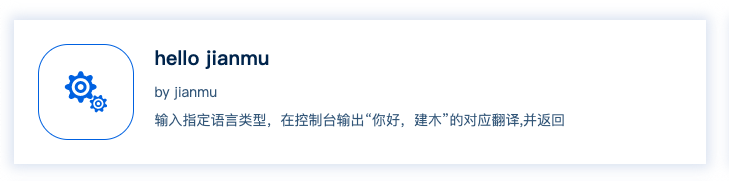

# 自定义节点
当节点库中的节点定义不满足场景需求时，用户可以通过自定义节点满足使用需求。   

用户可通过以下步骤使用自定义节点：  
1. 创建自定义节点  
2. 上传自定义节点到节点库  
3. 流程中引用自定义节点  

### 如何创建自定义节点
用户可创建自定义的节点定义dsl文件，来实现节点的自定义。

样例：   
```
name: hello jianmu
description: 输入指定语言类型，在控制台输出“你好，建木”的对应翻译,并返回
owner: jianmu
source: https://gitee.com/jianmu-examples/hello-jianmu
docs: https://gitee.com/jianmu-examples/hello-jianmu
ref: hello_jianmu
version: latest
resultFile: /tmp/return_hello
type: DOCKER
inputParameters:
  - ref: hello_language
    name: 指定翻译的语言
    type: SECRET
    value: Chinese
outputParameters:
  - ref: return_hello
    name: “你好，建木”翻译后的结果
    type: STRING
    value: 你好，建木
spec:
  image: 'jianmudev/hello-jianmu:latest'
  cmd:
    - /tmp/hello
  entrypoint:
    - /bin/sh
    - '-c'
```

定义说明：   
```
name: 节点定义名称，必填
description:  节点定义描述
owner: 节点所有者
source: 节点定义源码链接，可以在hub界面通过"源码"按钮跳转
docs: 节点定义的文档链接，可以在hub界面通过"源码"按钮跳转
ref: 节点定义的平台内部标识，必填
version: 节点定义的版本，必填
resultFile: 返回文件的路径，若定义了返回参数outputParameters，则必填。
type: 节点类型，当前只支持docker
inputParameters: 输入参数
    ref: 参数标识，会在容器内转译成'JIANMU_'开头并大写的环境变量。（如：hello_language在容器内可通过$JIANMU_HELLO_LANGUAGE调用）
    name: 变量名称
    type: 变量类型，支持STRING类型和SECRET类型
        STRING: 若变量类型为STRING，可直接填写值或引用其他变量
        SECRET: 若变量类型为SECRET，需要调用平台密钥，具体用法详见密钥管理章节
    value: 变量默认值，若调用该节点定义时没有指定该变量的值，将会使用此默认值
outputParameters: 输出参数，定义节点指定的返回值，需要在"resultFile"指定的文件内填写对应的json数据，key为输出参数的ref值。
spec: 镜像相关信息
    image: 指定该节点定义使用的容器镜像，执行时，平台将会从dockerhub拉取指定镜像版本，必填。
    cmd: list格式，指定容器运行时的command内容
    entrypoint: list格式，指定容器运行时的entrypoint内容
```

### 如何上传自定义节点到节点库
创建完任务定义的dsl文件后，可根据节点库中的`publish`节点创建流程推送该节点到节点库。具体用法可查看节点库`publish`节点的文档说明。以下为流程dsl样例：
```
workflow:
  name: 发布节点定义“hello-jianmu”
  ref: publish_hello_jianmu_task
  description: 这是一个发布自定义节点的流程定义样例
  Start:
    type: start
    targets:
      - Clone
  Clone:
    type: git:v1.0
    sources:
      - Start
    targets:
      - Publish
    param:
      workspace: hello-jianmu
      remote_url: https://gitee.com/jianmu-examples/hello-jianmu.git
      commit_branch: master
  Publish:
    type: hub_publish:v1.0
    sources:
      - Clone
    targets:
      - End
    param:
      registry_url: https://hub.jianmu.dev
      task_dsl_file:  hello-jianmu/task.dsl
      hub_appkey: ((jianmuhub.appkey))
  End:
    type: end
    sources:
      - Publish
```

执行成功后，可查看节点库界面，可以看到自定义节点已经推送成功。



### 如何在流程中使用自定义节点
自定义节点上传成功后，可在流程中通过ref:version指定该节点。
```
workflow:
  name: 样例——使用自定义节点
  ref: example_hello_jianmu
  description: 这是一个使用自定义节点的流程样例
  Start:
    type: start
    targets:
      - Hello_Jianmu
  Hello_Jianmu:
    type: hello_jianmu:latest
    sources:
      - Start
    targets:
      - End
    param:
      hello_language: Chinese
  End:
    type: end
    sources:
      - Hello_Jianmu
```
详细用法可参照[`流程定义`](flow-dsl.md)章节。
