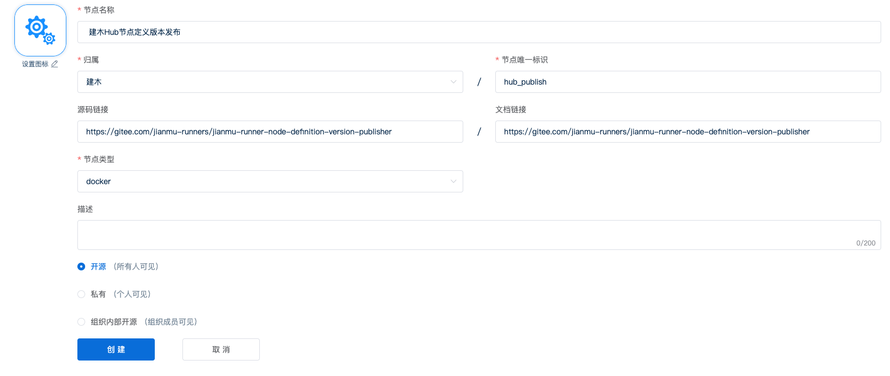
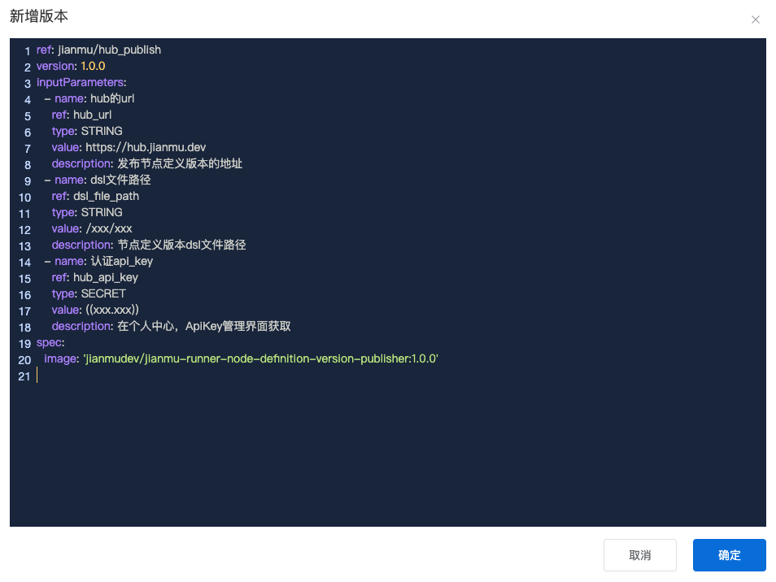
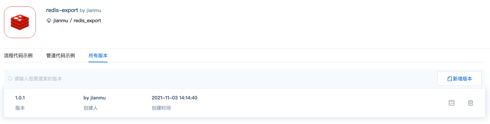

# 自定义节点

当节点库中的节点定义不满足场景需求时，用户可以通过自定义节点满足使用需求。

用户可通过以下步骤创建自定义节点：

1. 创建自定义节点
2. 上传自定义节点到节点库
3. 内置输入参数

### 1. 如何创建自定义节点

用户可以在[建木节点库](https://hub.jianmu.dev)创建节点，来实现节点的自定义。

1. 登录后点击头像进入个人主页，点击创建节点
2. 输入节点信息后点击创建，即创建成功
   

节点定义说明：

```
节点名称: 节点定义名称
归属: 节点所有者，可以选择个人或组织。组织在个人主页进行创建
节点唯一标识: 节点定义在归属内的唯一标识
源码链接: 节点详情界面通过"源码"按钮跳转
文档链接: 节点详情界面通过"文档"按钮跳转
节点类型: 节点类型，当前只支持docker
描述: 节点定义的描述
```

### 2. 如何创建节点定义版本

#### 2.1 通过 Hub 界面创建节点定义版本

1. 点击节点定义名称进入节点定义详情界面
2. 选择所有版本，点击新增版本
3. 输入节点定义版本的 dsl，点击确定，即创建成功
   

节点定义版本 dsl 说明：

| 关键字                            | 说明                                                                                                                                                                                                                    |
| --------------------------------- | ----------------------------------------------------------------------------------------------------------------------------------------------------------------------------------------------------------------------|
| ref                               | 归属人或归属组织的唯一标识/节点定义在归属内的唯一标识，必填，如：jianmu/hub_publish。若为官方节点定义，则可省略归属人或归属组织的唯一标识，如：hub_publish                                                                                   |
| version                           | 节点定义的版本，必填                                                                                                                                                                                                     |
| description                       | 节点定义的版本描述，需要添加换行符时，必须用引号将描述内容括起来，如：`"1.xxx\n2.xxx"`，选填                                                                                                                                                                                               |
| resultFile                        | 输出参数转换成 json 的文件路径，若定义了输出参数 outputParameters，则必填                                                                                                                                                      |
| inputParameters                   | 输入参数列表                                                                                                                                                                                                            |
| inputParameters.ref               | 参数唯一标识，会在容器内转译成'JIANMU\_'开头并大写的环境变量。如：hub_url 在容器内可通过 JIANMU_HUB_URL 环境变量调用，必填                                                                                                            |
| <span>inputParameters.name</span> | 参数名称，必填                                                                                                                                                                                                          |
| inputParameters.type              | 参数类型，支持 STRING、SECRET、NUMBER、BOOL 等类型，必填。STRING/NUMBER/BOOL: 若参数类型为 STRING/NUMBER/BOOL，可直接填写值或引用其他参数(事件、全局、其他任务的输出等参数)。SECRET: 若参数类型为 SECRET，需要调用平台密钥，具体用法详见密钥管理章节 |
| inputParameters.required          | 参数是否必填，默认为 false。<br/> required 为 false 或默认时，参数默认值 value 必填；required 为 true 时，不能有参数默认值 value                                                                                         |
| inputParameters.value             | 参数默认值，若没有指定参数值，将会使用此默认值，若 required 为 false 或默认时，则必填                                                                                                                                                            |
| inputParameters.description       | 参数描述，选填                                                                                                                                                                                                           |
| outputParameters                  | 输出参数，需要定义 **required**，格式同输入参数；<br/> 需要在"resultFile"指定的文件路径内填写对应的 json 数据，key 为输出参数的唯一标识（ref）值，格式同输入参数                                                                                                               |
| spec                              | 镜像相关信息，节点定义类型为 docker 时，必填                                                                                                                                                                                 |
| spec.image                        | 指定该节点定义使用的容器镜像，执行时，平台将会从 dockerhub 拉取指定镜像，必填                                                                                                                                                      |
| spec.cmd                          | list 格式，指定容器运行时的 command 内容，选填                                                                                                                                                                               |
| spec.entrypoint                   | list 格式，指定容器运行时的 entrypoint 内容，选填                                                                                                                                                                            |

节点定义版本示例:

```
ref: redis_export
version: 1.0.1
description: "1.该版本添加了输入参数的必填校验\n2.该版本添加了输出参数的必填校验"
inputParameters:
  - name: 主机地址
    ref: host
    type: SECRET
    required: true
    description: 主机地址
  - name: redis端口号
    ref: port
    type: NUMBER
    value: 6379
    description: redis端口号
  - name: redis密码
    ref: password
    type: SECRET
    value: ((xxx.xxx))
    description: redis密码
  - name: 数据库
    ref: database
    type: STRING
    value: ''
    description: 需要导出的数据库，默认为空，导出所有数据库
  - name: 模糊查询的key值
    ref: key
    type: STRING
    value: ''
    description: 模糊查询的key值，默认为空，导出所有key
outputParameters:
  - name: 导出的redis文件路径
    ref: redis_path
    type: STRING
    required: true
    description: 导出的redis文件路径
resultFile: /usr/result_file
spec:
  image: jianmudev/jianmu-runner-redis:1.0.0
  cmd:
    - bash
    - /usr/local/bin/export.sh
```

相关链接：

1. 节点输出参数：[参数](vars.md)
2. 调用平台密钥：[密钥管理](secrets.md)
3. spec 的其他非必填参数：[spec 参数](https://gitee.com/jianmu-dev/jianmu-ci-server/blob/master/embedded-worker/src/main/java/dev/jianmu/embedded/worker/aggregate/spec/ContainerSpec.java)

#### 2.2. 通过节点库中的`hub_publish`节点创建流程或管道推送该节点定义版本至节点库中

1.流程代码:

```
name: 发布节点定义版本 redis_export
description: 这是一个创建节点定义版本的流程定义样例

workflow:
  start:
    type: start
    targets:
      - git_clone
  git_clone:
    type: git_clone:1.2.0
    sources:
      - start
    targets:
      - hub_publish
    param:
      ref: refs/heads/master
      remote_url: https://gitee.com/jianmu-runners/jianmu-runner-redis.git
      username: ((gitee.username))
      password: ((gitee.password))
  hub_publish:
    type: hub_publish:1.0.1
    sources:
      - git_clone
    targets:
      - end
    param:
      hub_url: https://api.jianmu.run
      dsl_file_path: ${git_clone.git_path}/dsl/export.yml
      hub_api_ak: ((xxx.xxx))
      hub_api_sk: ((xxx.xxx))
  end:
    type: end
    sources:
      - hub_publish
```

hub_api_ak、hub_api_sk 获取步骤：

1. 登录节点库
2. 点击头像进入个人主页，再点击个人中心
3. 点击 ApiKey 管理，添加 ApiKey
   

2.管道代码；

```
name: 发布节点定义版本 redis_export
description: 这是一个创建节点定义版本的管道定义样例

pipeline:
  git_clone:
    type: git_clone:1.2.0
    param:
      remote_url: https://gitee.com/jianmu-runners/jianmu-runner-redis.git
      ref: refs/heads/master
      username: ((gitee.username))
      password: ((gitee.password))
  hub_publish:
    type: hub_publish:1.0.1
    param:
      hub_url: https://api.jianmu.run
      dsl_file_path: ${git_clone.git_path}/dsl/export.yml
      hub_api_ak: ((xxx.xxx))
      hub_api_sk: ((xxx.xxx))
```

执行成功后，查看节点定义详情界面，可以看到节点定义版本已经推送成功。


### 3. 内置输入参数

share_dir: 共享目录，容器中可通过 JM_SHARE_DIR 使用
