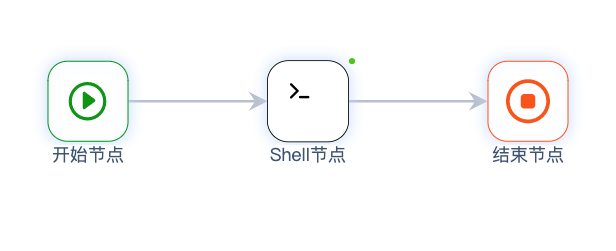

# 流程定义

CI/CD流程使用Yaml来定义

### workflow

流程定义在workflow段落下：

```
name: 流程名称
description: 流程描述

workflow:

```

### 流程节点

流程由节点组成，同一个流程中的节点名称不可重复：

```
  git_clone:
    type: git_clone:1.2.0
```

节点使用type字段来指定节点类型，节点类型由类型唯一标识`ref`与类型版本组成

如果不指定版本时，系统会使用默认版本`latest`,如

```
  git_clone:
    type: git_clone
```

等价于

```
  git_clone:
    type: git_clone:latest
```

### 节点别名
在流程中定义节点时，可以定义节点的别名，以便更好的区分节点的含义

使用`alias`来定义节点的别名
```
  shell_node:
    image: alpine:3.13.6
    alias: Shell节点 
    sources:
      - start
    targets:
      - end
    script:
      - echo hello jianmu
```
流程可视化界面会显示节点的别名，没有定义别名时，默认显示节点名称


### 节点执行顺序

流程从`start`类型的节点开始执行，到`end`类型的节点结束

节点使用`sources`和`targets`来分别指定当前节点的上游与下游节点，如下：

```
  start:
    type: start
    targets:
      - git_clone
  git_clone:
    type: git_clone:1.2.0
    sources:
      - start
    targets:
      - end
  end:
    type: end
    sources:
      - git_clone
```

`start`与`end`可以分别省略`sources`和`targets`定义，一个节点可以定义多个上游或下游节点

当存在多个下游节点时，当前节点执行成功后会并发触发下游节点

当存在多个上游节点时，当前节点会等待上游节点全部执行成功后才开始执行

### 节点参数

不同的节点类型定义了不同的参数，节点类型预先定义了`输入参数`和`输出参数`的名称、类型与默认值

在流程中配置节点时，可以覆盖`输入参数`的默认值，例如：

```
  git_clone:
    type: git_clone:1.2.0
    sources:
      - start
    targets:
      - end
    param:
      ref: refs/heads/master
      remote_url: https://gitee.com/jianmu-hub/dev-tools.git
      username: ((gitee.username))
      password: ((gitee.password))
```

`输入参数`和`输出参数`也可以使用参数方式引用，详情参见[`参数章节`](vars.md)