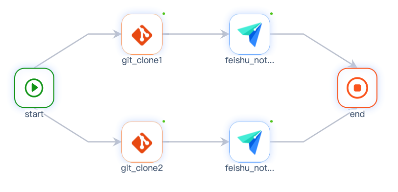
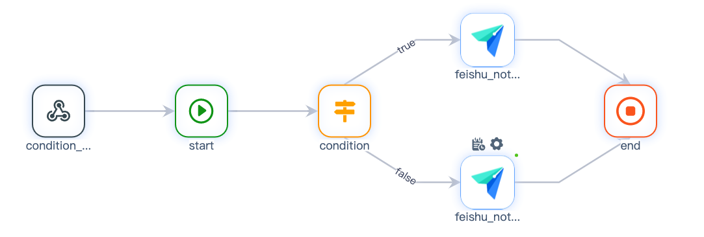

# 网关节点
### 并发网关

**概念**

在[流程定义](./flow-dsl.md)中，一个节点有多个上游/下游节点


当存在多个下游节点时，当前节点执行成功后会并发触发下游节点

当存在多个上游节点时，当前节点会等待上游节点全部执行成功后才开始执行

**语法**

通过`sources`定义多个上游节点
```
end:
  sources:
    - feishu_notice_post1
    - feishu_notice_post2
  type: end
```
通过`targets`定义多个下游节点
```
start:
  targets:
    - git_clone1
    - git_clone2
  type: start
```

### 条件网关

**概念**

在[流程定义](./flow-dsl.md)中，使用`condition`节点，定义表达式`expression`，具体参考[表达式](./expression.md)一览

通过条件`cases`判断true / false，执行对应的节点



**语法**
```
condition:
  sources:
    - start
  type: condition
  expression: ${event.number}>100
  cases:
    true: feishu_notice_post1
    false: feishu_notice_post2
```
其中，`${event.number}`为事件参数，也可以为`常量`或其他[参数](./vars.md)
