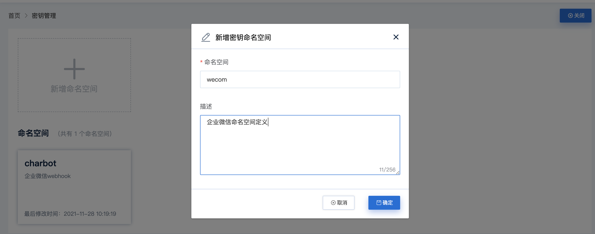
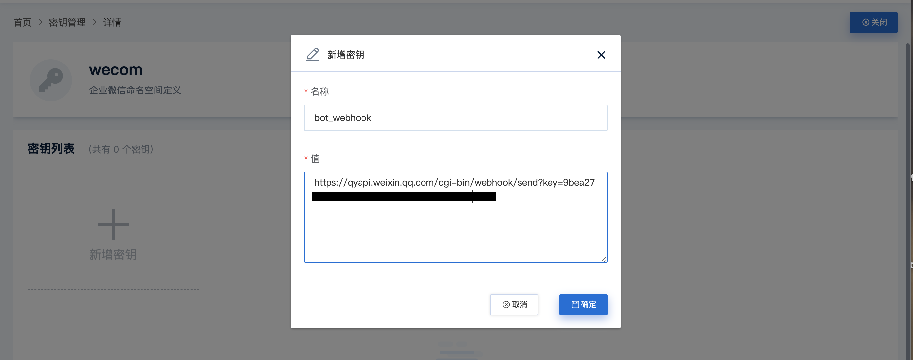
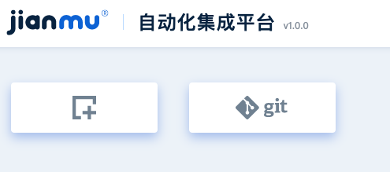

# 快速开始

建木持续集成平台作为入门可以采用本文档描述的配置进行快速体验使用。

## 系统和软件准备

### 资源和系统要求

建议操作系统：Ubuntu 21.04（macOS Monterey）
建议配置：
* CPU：2C
* 内存：8GB
* 磁盘：100GB

### 软件版本要求

* 推荐使用Ubuntu 21.04系统安装，如[CentOS 7可参考](https://docs.jianmu.dev/guide/centos-install.html)。
* Docker 19.30以上，[官方安装手册](https://docs.docker.com/get-started/#download-and-install-docker)
* Docker-Compose 1.29.2以上，[官方安装手册](https://docs.docker.com/compose/install/#install-compose)
* Kubernetes 1.18以上, [官方安装手册](https://kubernetes.io/docs/tasks/tools/)

## 建木安装

### docker-compose部署

**下载`docker-compose.yml`**

```
wget https://gitee.com/jianmu-dev/jianmu-deploy/raw/master/docker-compose.yml
```

**启动**

```
docker-compose up -d
```

访问[`http://localhost`](http://localhost)，默认用户名密码为`admin/123456`。


### k8s部署
**下载`kubernetes.yaml`**
```
wget https://gitee.com/jianmu-dev/jianmu-deploy/raw/master/kubernetes.yaml
```

**启动**

```
kubectl apply -f kubernetes.yaml
```

访问[`node节点ip:30180`](http://node节点ip:30180)，默认用户名密码为`admin/123456`，使用详见hello项目使用。


## 建木快速使用

### 创建第一个项目(来自建木的问候)

#### 前提条件说明

* 有企业微信账号
* 新建一个测试群
* 测试群添加一个机器人，并获取机器人的webhook，形如：`https://qyapi.weixin.qq.com/cgi-bin/webhook/send?key=06de918a-fd35-45b7-b2e6-cff28371fd5d`

#### 设置企业微信空间

1. 创建企业微信用户空间，点击密钥管理，填写命名空间和描述如下：

2. 进入命名空间，创建密钥，填写名称和值，参考如下


#### 创建并执行第一个项目

1. 创建第一个hello项目

2. 点击git图标，URL输入`https://gitee.com/jianmu-dev/jianmu-docs.git`
3. 填写分支为`master`
4. 关闭下方的认证开关，点击下一步
5. 选择`hello_world.yml`，点击保存

#### 实现效果

1. 您可以点击项目立即触发执行，届时可以看到测试企业群的Bot就会给你第一个问候。
2. 系统将会根据导入的yaml文件生成名为`hello_world`的流程并在每小时的0/30分时触发执行。

