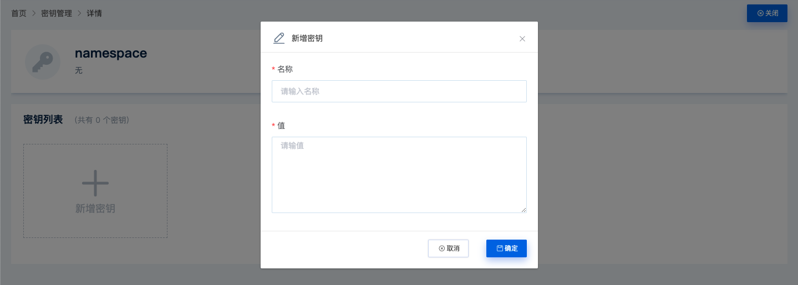
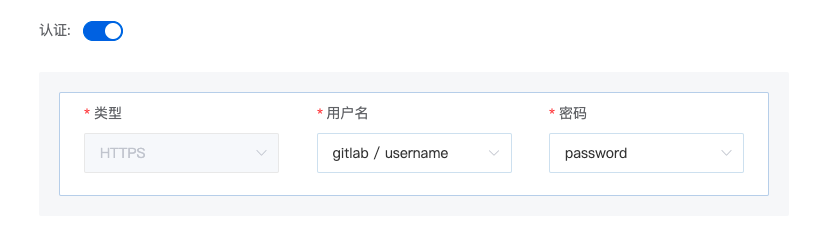

# 密钥管理

### 新增命名空间

点击右上角钥匙图标，进入密钥管理界面


点击“新增命名空间”框，填写命名空间名称后，点击确定，即可创建命名空间。

### 新增密钥

创建命名空间或，点击对应命名空间标签，进入命名空间



点击“新增密钥”框，填写密钥名称和值后，点击确定，即可创建密钥。

### 密钥使用

#### 流程中使用

密钥可在流程定义中作为节点参数使用，例如：

```
    param:
      username: ((namespace.username))
      password: ((namespace.password))

```

#### 导入项目时使用

平台导入项目时，若访问的 git 项目需要认证，则需要在密钥管理中创建对应命名空间，保存用户名和密码

例：

1. 创建 gitlab 认证密钥

   1. 创建命名空间：gitlab
   2. 新增密钥：username：admin
   3. 新增密钥：password：123456

2. 在导入项目时，选择认证，并在用户名中选择 gitlab 命名空间的 username，密码选择 password（注意：密码和用户名需要在同一命名空间内）



### 密钥删除

点击密钥标签右上角删除按钮，会弹出删除密钥提示框，点击确定后，即可删除密钥。

### 命名空间删除

点击命名空间标签右上角删除按钮，会弹出删除密钥提示框，点击确定后，即可删除对应命名空间，删除命名空间时，会同步删除其中所有的密钥。
