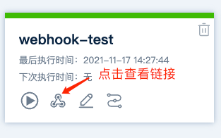

# Webhook

Webhook可以接收外部事件来触发项目执行

### 如何定义

**定义语法**
```
trigger:
  type: webhook
  param:
    - name:  xxx
      type: STRING
      exp: $.xxx.xxx
  auth: 
    token: ${trigger.xxx}
    value: ((xxx.xxx))
  only: (${trigger.xxx} == "xxx")
```
* type: 此处固定填`webhook`，必填
* param: 触发器参数，非必填，*引用触发器参数参考[参数章节](vars.md)*
    * name: 参数名称，必填
    * type: 参数类型，支持类型：STRING、NUMBER、BOOL、SECRET，必填
    * exp: 提取参数表达式，必填，*详见[提取规则](#触发器参数提取规则)*
* auth: 认证鉴权，非必填
    * token: Webhook请求携带的认证鉴权数据，如：请求头中的Authorization、Token等，`auth`存在时必填，支持[运算表达式](expression.md#运算表达式)和[字符串模版](expression.md#字符串模版)
    * value: 用于校验`token`值，相同则验证成功，必须是密钥类型，`auth`存在时必填
* only: 匹配规则，结果为 true 时触发流程，可以引用`全局参数`、`触发器参数`，非必填。*详见[运算表达式](expression.md)*

**示例**
```
trigger:
  type: webhook
  param:
    - name: gitee_token
      type: SECRET
      exp: $.header.X-Gitee-Token
    - name: pr_state
      type: STRING
      exp: $.body.json.pull_request.state
    - name: pr_target_branch
      type: STRING
      exp: $.body.json.target_branch
  auth:
    token: ${trigger.gitee_token}
    value: ((gitee.webhook_token))
  only: ((${trigger.pr_target_branch} == "wap" || ${trigger.pr_target_branch} == "web") && ${trigger.pr_state} == "merged")
```
在项目DSL中添加以上定义，保存后会自动生成 Webhook链接


### 触发器参数提取规则

可使用 [JsonPath](https://goessner.net/articles/JsonPath/) 从Webhook请求中提取触发器参数，以供项目DSL中引用

根据提取的位置不同，提取规则如下：

* Header：$.header.xxx
* Query：$.query.xxx
* Body：
  * JSON: $.body.json.xxx
  * Form表单：$.body.form.xxx
  * Text: $.body.text

**Webhook请求参数示例**
```
Webhook:
payload: {
  "header": {
    "content-length": "149",
    "postman-token": "2ffe99d2-ff91-4546-a029-a9da8093c1ff",
    "x-nginx-proxy": "true",
    "connection": "close",
    "content-type": "application/json",
    "x-client-type": "jianmu",
    "accept": "*/*"
  },
  "query": {
    "phone": "10086"
  },
  "body": {
    "json": {
      "token": "yWi6XOJQ2VQ9BKSUnlK9jTiHY",
      "user": [
        {
          "name": "Jerry",
          "age": 3
        },
        {
          "name": "Tom",
          "age": 5
        }
      ]
    }
  }
}
```

**提取示例**
```
trigger:
  type: webhook
  param:
    - name: type
      type: STRING
      exp: $.header.x-client-type
    - name: phone
      type: STRING
      exp: $.query.phone
    - name: token
      type: STRING
      exp: $.body.json.token
    - name: name
      type: STRIING
      exp: $.body.json.user[0].name
    - name: age
      type: NUMBER
      exp: $.body.json.user[0].age
    
```
表达式`$.header.x-client-type`的结果是`"jianmu"`

表达式`$.query.phone`的结果是`"10086"`

表达式`$.body.json.token`的结果是`"yWi6XOJQ2VQ9BKSUnlK9jTiHY"`

表达式`$.body.json.user[0].name`的结果是`"Jerry"`

表达式`$.body.json.user[0].age`的结果是`3`

*更高阶的用法和具体语法规范可以参考[这里](https://goessner.net/articles/JsonPath/)*
